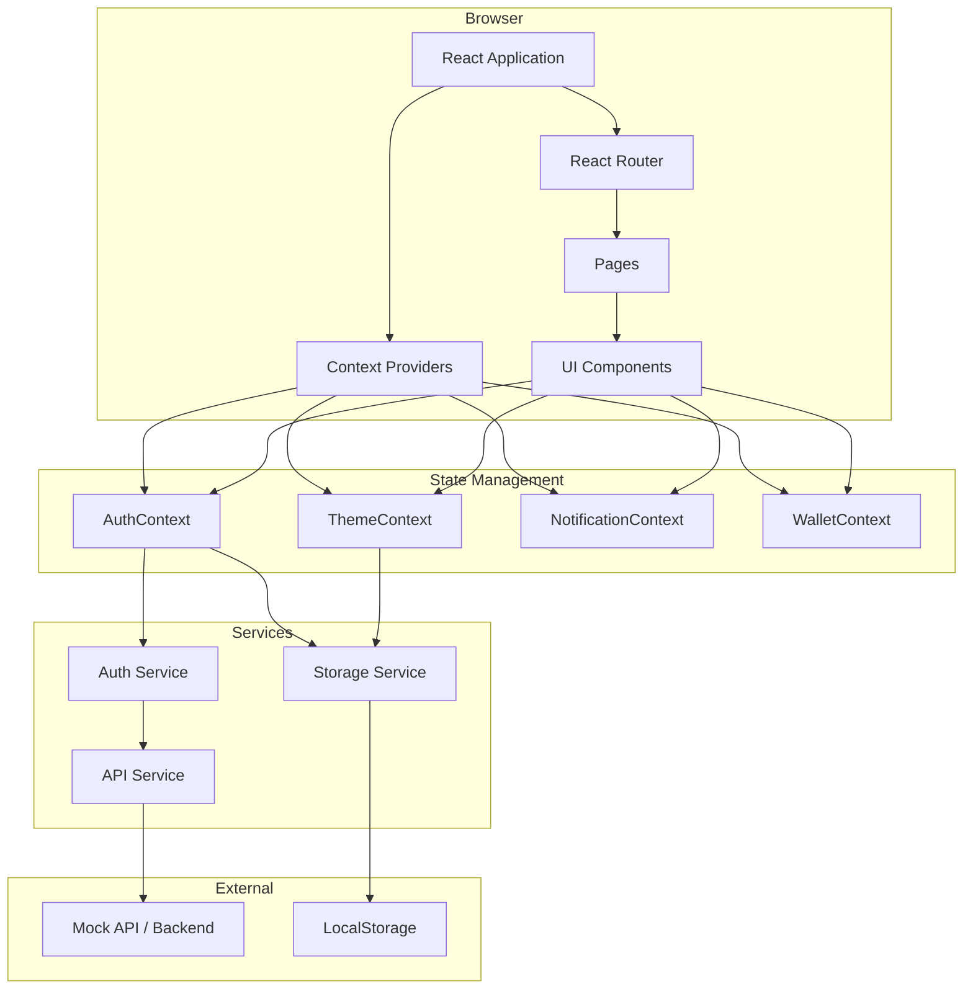
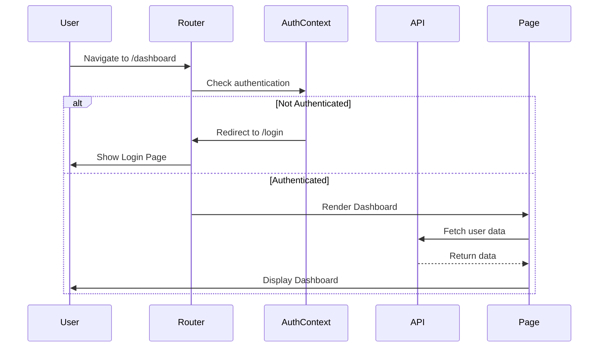

# Design Document: Taskora Frontend Platform

## Overview

### Purpose

The Taskora Frontend Platform is a production-ready React.js single-page application (SPA) that provides a modern SaaS experience for a task and campaign marketplace. The platform connects three distinct user roles—regular users (task participants), campaign creators (businesses/content creators), and administrators—through an intuitive, responsive, and accessible interface.

### Architecture Philosophy

The design follows a component-based architecture with clear separation of concerns:

- **Presentation Layer**: Reusable UI components built with React and styled with Tailwind CSS
- **State Management Layer**: React Context API for global state (authentication, theme, notifications, wallet)
- **Routing Layer**: React Router v6 for client-side navigation with role-based access control
- **Data Layer**: Axios-based HTTP client with interceptors for API communication
- **Animation Layer**: Framer Motion for smooth transitions and micro-interactions

### Technology Stack

- **Core**: React 19.2.5, Vite 8.0.10
- **Routing**: React Router v6
- **Styling**: Tailwind CSS with custom theme configuration
- **HTTP Client**: Axios
- **Icons**: React Icons
- **Animations**: Framer Motion
- **Charts**: Recharts
- **Build Tool**: Vite with code splitting and optimization

### Key Design Principles

1. **Role-Based Access**: Different UI experiences for Users, Creators, and Admins
2. **Responsive First**: Mobile-first design approach with breakpoints at 640px, 768px, 1024px, 1280px
3. **Accessibility**: WCAG AA compliance with semantic HTML, ARIA labels, and keyboard navigation
4. **Performance**: Code splitting, lazy loading, and optimized bundle sizes
5. **Maintainability**: Consistent component patterns, clear folder structure, and reusable utilities
6. **User Experience**: Smooth animations, clear feedback, and intuitive navigation

## Architecture

### High-Level System Architecture



### Application Flow



### Folder Structure

```
src/
├── assets/              # Static assets (images, icons, fonts)
│   ├── images/
│   ├── icons/
│   └── fonts/
├── components/          # Reusable UI components
│   ├── common/         # Generic components (Button, Input, Modal, etc.)
│   ├── layout/         # Layout components (Sidebar, Navbar, Footer)
│   └── features/       # Feature-specific components
│       ├── tasks/
│       ├── campaigns/
│       ├── wallet/
│       └── notifications/
├── contexts/           # React Context providers
│   ├── AuthContext.jsx
│   ├── ThemeContext.jsx
│   ├── NotificationContext.jsx
│   └── WalletContext.jsx
├── hooks/              # Custom React hooks
│   ├── useAuth.js
│   ├── useTheme.js
│   ├── useNotifications.js
│   ├── useWallet.js
│   └── useDebounce.js
├── layouts/            # Page layout wrappers
│   ├── PublicLayout.jsx
│   ├── AuthenticatedLayout.jsx
│   └── AdminLayout.jsx
├── pages/              # Page components (route targets)
│   ├── public/
│   │   ├── Landing.jsx
│   │   ├── Login.jsx
│   │   ├── Register.jsx
│   │   └── ForgotPassword.jsx
│   ├── user/
│   │   ├── Dashboard.jsx
│   │   ├── Tasks.jsx
│   │   ├── TaskDetails.jsx
│   │   ├── MyTasks.jsx
│   │   ├── Wallet.jsx
│   │   ├── Transactions.jsx
│   │   ├── Notifications.jsx
│   │   ├── Profile.jsx
│   │   └── Settings.jsx
│   ├── creator/
│   │   ├── CreateCampaign.jsx
│   │   ├── MyCampaigns.jsx
│   │   └── CampaignDetails.jsx
│   └── admin/
│       └── AdminDashboard.jsx
├── services/           # API and external service integrations
│   ├── api.js         # Axios instance and configuration
│   ├── authService.js
│   ├── taskService.js
│   ├── campaignService.js
│   ├── walletService.js
│   ├── notificationService.js
│   └── mockApi.js     # Mock API for development
├── utils/              # Utility functions
│   ├── validators.js
│   ├── formatters.js
│   ├── constants.js
│   └── helpers.js
├── routes/             # Route configuration
│   ├── index.jsx
│   ├── ProtectedRoute.jsx
│   └── RoleBasedRoute.jsx
├── data/               # Static data and mock data
│   └── mockData.js
├── App.jsx             # Root component
├── main.jsx            # Application entry point
└── index.css           # Global styles and Tailwind imports
```

### Routing Architecture

The application uses React Router v6 with nested routes and route guards:

```jsx
// Route Structure
<Routes>
  {/* Public Routes */}
  <Route path="/" element={<PublicLayout />}>
    <Route index element={<Landing />} />
    <Route path="login" element={<Login />} />
    <Route path="register" element={<Register />} />
    <Route path="forgot-password" element={<ForgotPassword />} />
  </Route>

  {/* Protected Routes - All Authenticated Users */}
  <Route element={<ProtectedRoute />}>
    <Route element={<AuthenticatedLayout />}>
      <Route path="dashboard" element={<Dashboard />} />
      <Route path="tasks" element={<Tasks />} />
      <Route path="tasks/:id" element={<TaskDetails />} />
      <Route path="my-tasks" element={<MyTasks />} />
      <Route path="wallet" element={<Wallet />} />
      <Route path="transactions" element={<Transactions />} />
      <Route path="notifications" element={<Notifications />} />
      <Route path="profile" element={<Profile />} />
      <Route path="settings" element={<Settings />} />
    </Route>
  </Route>

  {/* Creator-Only Routes */}
  <Route element={<RoleBasedRoute allowedRoles={['creator', 'admin']} />}>
    <Route element={<AuthenticatedLayout />}>
      <Route path="campaigns/create" element={<CreateCampaign />} />
      <Route path="campaigns" element={<MyCampaigns />} />
      <Route path="campaigns/:id" element={<CampaignDetails />} />
    </Route>
  </Route>

  {/* Admin-Only Routes */}
  <Route element={<RoleBasedRoute allowedRoles={['admin']} />}>
    <Route element={<AdminLayout />}>
      <Route path="admin" element={<AdminDashboard />} />
    </Route>
  </Route>

  {/* 404 */}
  <Route path="*" element={<NotFound />} />
</Routes>
```

**Route Guard Logic:**

1. **ProtectedRoute**: Checks if user is authenticated
   - If not authenticated → redirect to `/login`
   - If authenticated → render child routes

2. **RoleBasedRoute**: Checks if user has required role
   - If role not allowed → redirect to `/dashboard` or show unauthorized page
   - If role allowed → render child routes

## Components and Interfaces

### Context Providers

#### AuthContext

**Purpose**: Manages authentication state and user session across the application.

**State:**
```typescript
interface AuthState {
  isAuthenticated: boolean;
  user: User | null;
  token: string | null;
  loading: boolean;
}

interface User {
  id: string;
  name: string;
  email: string;
  role: 'user' | 'creator' | 'admin';
  avatar?: string;
  createdAt: string;
}
```

**Methods:**
- `login(email: string, password: string): Promise<void>`
- `register(userData: RegisterData): Promise<void>`
- `logout(): void`
- `updateUser(userData: Partial<User>): Promise<void>`
- `checkAuth(): Promise<void>` - Validates existing token on app load

**Implementation Details:**
- Stores token in localStorage with key `taskora_auth_token`
- Automatically attaches token to API requests via Axios interceptor
- Clears all auth data on logout
- Restores session on app initialization if valid token exists

#### ThemeContext

**Purpose**: Manages light/dark mode theme preference.

**State:**
```typescript
interface ThemeState {
  theme: 'light' | 'dark';
}
```

**Methods:**
- `toggleTheme(): void`
- `setTheme(theme: 'light' | 'dark'): void`

**Implementation Details:**
- Persists theme preference in localStorage with key `taskora_theme`
- Applies/removes `dark` class on document root element
- Initializes from localStorage or system preference (`prefers-color-scheme`)

#### NotificationContext

**Purpose**: Manages notification state and unread count.

**State:**
```typescript
interface NotificationState {
  notifications: Notification[];
  unreadCount: number;
  loading: boolean;
}

interface Notification {
  id: string;
  type: 'task_update' | 'payment' | 'system';
  title: string;
  message: string;
  read: boolean;
  createdAt: string;
  link?: string;
}
```

**Methods:**
- `fetchNotifications(): Promise<void>`
- `markAsRead(id: string): Promise<void>`
- `markAllAsRead(): Promise<void>`
- `addNotification(notification: Notification): void` - For real-time updates

**Implementation Details:**
- Polls for new notifications every 60 seconds when user is authenticated
- Updates unread count badge in navbar
- Supports navigation to relevant page when notification is clicked

#### WalletContext

**Purpose**: Manages wallet balance and provides quick access to financial data.

**State:**
```typescript
interface WalletState {
  balance: number;
  totalEarnings: number;
  totalWithdrawals: number;
  pendingWithdrawals: number;
  loading: boolean;
}
```

**Methods:**
- `fetchWalletData(): Promise<void>`
- `withdraw(amount: number, method: string): Promise<void>`
- `refreshBalance(): Promise<void>`

**Implementation Details:**
- Fetches wallet data on context initialization
- Provides real-time balance updates after task completions
- Refreshes data when wallet-related pages are visited

### Layout Components

#### AuthenticatedLayout

**Purpose**: Wrapper layout for all authenticated pages with sidebar and navbar.

**Structure:**
```jsx
<div className="flex h-screen bg-gray-50 dark:bg-gray-900">
  <Sidebar />
  <div className="flex-1 flex flex-col overflow-hidden">
    <Navbar />
    <main className="flex-1 overflow-y-auto p-6">
      <Outlet /> {/* Child routes render here */}
    </main>
  </div>
</div>
```

**Responsive Behavior:**
- Desktop (≥1024px): Sidebar visible, fixed width (256px)
- Tablet/Mobile (<1024px): Sidebar hidden, hamburger menu in navbar

#### Sidebar

**Purpose**: Primary navigation menu for authenticated users.

**Props:**
```typescript
interface SidebarProps {
  isOpen: boolean;
  onClose: () => void;
}
```

**Menu Items (Role-Based):**

**All Users:**
- Dashboard (`/dashboard`)
- Tasks (`/tasks`)
- My Tasks (`/my-tasks`)
- Wallet (`/wallet`)
- Transactions (`/transactions`)
- Notifications (`/notifications`)
- Profile (`/profile`)
- Settings (`/settings`)

**Creators (additional):**
- Create Campaign (`/campaigns/create`)
- My Campaigns (`/campaigns`)

**Admins (additional):**
- Admin Dashboard (`/admin`)

**Features:**
- Active route highlighting with accent color
- Icon + label for each menu item
- Logout button at bottom
- Smooth slide animation on mobile
- Backdrop overlay on mobile when open

#### Navbar

**Purpose**: Top navigation bar with search, notifications, theme toggle, and user menu.

**Structure:**
```jsx
<nav className="bg-white dark:bg-gray-800 border-b border-gray-200 dark:border-gray-700 px-6 py-4">
  <div className="flex items-center justify-between">
    {/* Left: Logo + Hamburger (mobile) */}
    <div className="flex items-center gap-4">
      <button className="lg:hidden" onClick={toggleSidebar}>
        <MenuIcon />
      </button>
      <Logo />
    </div>

    {/* Center: Search (desktop only) */}
    <div className="hidden md:block flex-1 max-w-xl mx-8">
      <SearchInput />
    </div>

    {/* Right: Actions */}
    <div className="flex items-center gap-4">
      <NotificationButton unreadCount={unreadCount} />
      <ThemeToggle />
      <UserMenu />
    </div>
  </div>
</nav>
```

**Components:**
- **NotificationButton**: Bell icon with badge, opens dropdown with recent notifications
- **ThemeToggle**: Sun/Moon icon toggle
- **UserMenu**: Avatar with dropdown (Profile, Settings, Logout)

### Common UI Components

#### Button

**Props:**
```typescript
interface ButtonProps {
  variant?: 'primary' | 'secondary' | 'danger' | 'outline' | 'ghost';
  size?: 'sm' | 'md' | 'lg';
  loading?: boolean;
  disabled?: boolean;
  icon?: ReactNode;
  children: ReactNode;
  onClick?: () => void;
  type?: 'button' | 'submit' | 'reset';
}
```

**Variants:**
- `primary`: Purple gradient background, white text
- `secondary`: Gray background, dark text
- `danger`: Red background, white text
- `outline`: Transparent background, colored border
- `ghost`: Transparent background, no border, hover effect

**Accessibility:**
- Disabled state with reduced opacity and cursor-not-allowed
- Loading state with spinner and disabled interaction
- Focus ring on keyboard navigation

#### Input

**Props:**
```typescript
interface InputProps {
  type?: 'text' | 'email' | 'password' | 'number' | 'tel';
  label?: string;
  placeholder?: string;
  value: string;
  onChange: (value: string) => void;
  error?: string;
  success?: boolean;
  disabled?: boolean;
  icon?: ReactNode;
  required?: boolean;
}
```

**States:**
- Default: Gray border
- Focus: Blue border, focus ring
- Error: Red border, error message below
- Success: Green border, checkmark icon
- Disabled: Gray background, cursor-not-allowed

#### Modal

**Props:**
```typescript
interface ModalProps {
  isOpen: boolean;
  onClose: () => void;
  title?: string;
  children: ReactNode;
  size?: 'sm' | 'md' | 'lg' | 'xl';
  showCloseButton?: boolean;
}
```

**Features:**
- Backdrop with blur effect
- Centered positioning
- Framer Motion fade + scale animation
- Close on backdrop click (optional)
- Close on Escape key
- Focus trap (keyboard navigation stays within modal)
- Scroll lock on body when open

#### Card

**Props:**
```typescript
interface CardProps {
  children: ReactNode;
  className?: string;
  hover?: boolean;
  onClick?: () => void;
}
```

**Styling:**
- White background (dark: gray-800)
- Rounded corners (border-radius: 12px)
- Shadow (light: shadow-sm, dark: shadow-lg)
- Optional hover effect (scale + shadow increase)

#### Badge

**Props:**
```typescript
interface BadgeProps {
  variant?: 'success' | 'danger' | 'warning' | 'info' | 'default';
  children: ReactNode;
  size?: 'sm' | 'md';
}
```

**Variants:**
- `success`: Green background
- `danger`: Red background
- `warning`: Yellow background
- `info`: Blue background
- `default`: Gray background

#### Toast

**Props:**
```typescript
interface ToastProps {
  type: 'success' | 'error' | 'info' | 'warning';
  message: string;
  duration?: number; // Auto-dismiss after duration (ms)
  onClose: () => void;
}
```

**Features:**
- Positioned at top-right corner
- Slide-in animation from right
- Auto-dismiss after 5 seconds (configurable)
- Manual close button
- Icon based on type
- Stacking support for multiple toasts

#### Pagination

**Props:**
```typescript
interface PaginationProps {
  currentPage: number;
  totalPages: number;
  onPageChange: (page: number) => void;
  showPageNumbers?: boolean;
  maxPageNumbers?: number; // Max page numbers to show (default: 5)
}
```

**Features:**
- Previous/Next buttons
- Page number buttons (with ellipsis for large ranges)
- Current page highlighted
- Disabled state for first/last page
- Keyboard navigation support

#### EmptyState

**Props:**
```typescript
interface EmptyStateProps {
  icon?: ReactNode;
  title: string;
  description?: string;
  action?: {
    label: string;
    onClick: () => void;
  };
}
```

**Usage:**
- Displayed when lists/tables have no data
- Provides clear messaging and optional action button

#### Loader

**Props:**
```typescript
interface LoaderProps {
  size?: 'sm' | 'md' | 'lg';
  fullScreen?: boolean;
  text?: string;
}
```

**Variants:**
- Inline spinner (for buttons, small sections)
- Full-screen overlay (for page loads)
- With optional loading text

### Feature Components

#### TaskCard

**Purpose**: Displays task summary in marketplace and my tasks pages.

**Props:**
```typescript
interface TaskCardProps {
  task: Task;
  onClick: () => void;
  showStatus?: boolean; // For My Tasks page
}

interface Task {
  id: string;
  title: string;
  description: string;
  type: 'post' | 'follow' | 'comment' | 'share' | 'download' | 'visit';
  reward: number;
  remainingSlots?: number;
  estimatedTime: number; // minutes
  status?: 'pending' | 'approved' | 'rejected';
}
```

**Layout:**
```
┌─────────────────────────────────┐
│ [Icon] Task Type                │
│ Task Title                      │
│ Description preview...          │
│                                 │
│ 💰 $5.00  ⏱️ 5 min  👥 10 left │
│ [Status Badge] (if applicable)  │
└─────────────────────────────────┘
```

#### CampaignCard

**Purpose**: Displays campaign summary in My Campaigns page.

**Props:**
```typescript
interface CampaignCardProps {
  campaign: Campaign;
  onClick: () => void;
}

interface Campaign {
  id: string;
  name: string;
  status: 'active' | 'paused' | 'completed';
  budget: number;
  spent: number;
  participants: number;
  completionRate: number;
  createdAt: string;
}
```

**Layout:**
```
┌─────────────────────────────────┐
│ Campaign Name      [Status]     │
│ Progress: ████████░░ 80%        │
│                                 │
│ Budget: $500 / $1000            │
│ Participants: 45                │
│ Completion: 80%                 │
│                                 │
│ [Pause] [Edit] [View Details]   │
└─────────────────────────────────┘
```

#### TransactionRow

**Purpose**: Displays transaction in wallet/transactions table.

**Props:**
```typescript
interface TransactionRowProps {
  transaction: Transaction;
  onClick?: () => void;
}

interface Transaction {
  id: string;
  type: 'earning' | 'withdrawal' | 'refund';
  amount: number;
  status: 'completed' | 'pending' | 'failed';
  description: string;
  date: string;
}
```

#### NotificationItem

**Purpose**: Displays notification in dropdown and notifications page.

**Props:**
```typescript
interface NotificationItemProps {
  notification: Notification;
  onClick: () => void;
}
```

**Layout:**
```
┌─────────────────────────────────┐
│ [Icon] Notification Title       │
│        Message text...          │
│        2 hours ago              │
│ [Unread indicator]              │
└─────────────────────────────────┘
```

## Data Models

### User Model

```typescript
interface User {
  id: string;
  name: string;
  email: string;
  role: 'user' | 'creator' | 'admin';
  avatar?: string;
  phone?: string;
  bio?: string;
  createdAt: string;
  stats: {
    tasksCompleted: number;
    totalEarned: number;
    activeTasks: number;
  };
}
```

### Task Model

```typescript
interface Task {
  id: string;
  campaignId: string;
  title: string;
  description: string;
  type: 'post' | 'follow' | 'comment' | 'share' | 'download' | 'visit';
  reward: number;
  instructions: string[];
  requirements: string[];
  estimatedTime: number; // minutes
  totalSlots: number;
  remainingSlots: number;
  status: 'active' | 'paused' | 'completed';
  createdAt: string;
  expiresAt?: string;
}
```

### Task Submission Model

```typescript
interface TaskSubmission {
  id: string;
  taskId: string;
  userId: string;
  proof: {
    type: 'url' | 'file';
    value: string; // URL or file path
  };
  status: 'pending' | 'approved' | 'rejected';
  submittedAt: string;
  reviewedAt?: string;
  rejectionReason?: string;
}
```

### Campaign Model

```typescript
interface Campaign {
  id: string;
  creatorId: string;
  name: string;
  description: string;
  category: string;
  status: 'draft' | 'active' | 'paused' | 'completed';
  budget: number;
  spent: number;
  tasks: Task[];
  participants: number;
  completionRate: number;
  startDate: string;
  endDate?: string;
  createdAt: string;
}
```

### Wallet Model

```typescript
interface Wallet {
  userId: string;
  balance: number;
  totalEarnings: number;
  totalWithdrawals: number;
  pendingWithdrawals: number;
  currency: string; // 'USD'
}
```

### Transaction Model

```typescript
interface Transaction {
  id: string;
  userId: string;
  type: 'earning' | 'withdrawal' | 'refund' | 'bonus';
  amount: number;
  status: 'completed' | 'pending' | 'failed';
  description: string;
  metadata?: {
    taskId?: string;
    campaignId?: string;
    withdrawalMethod?: string;
  };
  createdAt: string;
  completedAt?: string;
}
```

### Notification Model

```typescript
interface Notification {
  id: string;
  userId: string;
  type: 'task_update' | 'payment' | 'system' | 'campaign';
  title: string;
  message: string;
  read: boolean;
  link?: string; // Navigation target
  createdAt: string;
}
```

### Settings Model

```typescript
interface UserSettings {
  userId: string;
  notifications: {
    email: boolean;
    push: boolean;
    taskUpdates: boolean;
    paymentUpdates: boolean;
    systemAnnouncements: boolean;
  };
  privacy: {
    profileVisibility: 'public' | 'private';
    showEarnings: boolean;
    dataSharing: boolean;
  };
  security: {
    twoFactorEnabled: boolean;
    activeSessions: Session[];
  };
}

interface Session {
  id: string;
  device: string;
  location: string;
  lastActive: string;
  current: boolean;
}
```

### API Response Models

```typescript
// Standard API response wrapper
interface ApiResponse<T> {
  success: boolean;
  data?: T;
  error?: {
    code: string;
    message: string;
  };
  meta?: {
    page?: number;
    totalPages?: number;
    totalItems?: number;
  };
}

// Paginated list response
interface PaginatedResponse<T> {
  items: T[];
  page: number;
  pageSize: number;
  totalPages: number;
  totalItems: number;
}
```

### Form Data Models

```typescript
interface LoginFormData {
  email: string;
  password: string;
  rememberMe: boolean;
}

interface RegisterFormData {
  name: string;
  email: string;
  password: string;
  passwordConfirm: string;
  role: 'user' | 'creator';
}

interface CreateCampaignFormData {
  name: string;
  description: string;
  category: string;
  duration: number; // days
  tasks: CreateTaskFormData[];
  budget: number;
  paymentMethod: string;
}

interface CreateTaskFormData {
  title: string;
  description: string;
  type: 'post' | 'follow' | 'comment' | 'share' | 'download' | 'visit';
  reward: number;
  instructions: string[];
  requirements: string[];
  estimatedTime: number;
  totalSlots: number;
}

interface WithdrawalFormData {
  amount: number;
  method: 'paypal' | 'bank_transfer' | 'crypto';
  accountDetails: string;
}
```


## Error Handling

### Error Handling Strategy

The application implements a multi-layered error handling approach to provide clear feedback and graceful degradation:

#### 1. API Error Handling

**Axios Interceptor Configuration:**

```javascript
// Response interceptor for global error handling
api.interceptors.response.use(
  (response) => response,
  (error) => {
    if (error.response) {
      // Server responded with error status
      switch (error.response.status) {
        case 401:
          // Unauthorized - clear auth and redirect to login
          authContext.logout();
          navigate('/login');
          showToast('error', 'Session expired. Please log in again.');
          break;
        case 403:
          // Forbidden - insufficient permissions
          showToast('error', 'You do not have permission to perform this action.');
          break;
        case 404:
          // Not found
          showToast('error', 'The requested resource was not found.');
          break;
        case 422:
          // Validation error - return for form handling
          return Promise.reject(error.response.data);
        case 500:
          // Server error
          showToast('error', 'Server error. Please try again later.');
          break;
        default:
          showToast('error', error.response.data?.message || 'An error occurred.');
      }
    } else if (error.request) {
      // Request made but no response received
      showToast('error', 'Network error. Please check your connection.');
    } else {
      // Something else happened
      showToast('error', 'An unexpected error occurred.');
    }
    return Promise.reject(error);
  }
);
```

**Error Response Format:**

```typescript
interface ApiError {
  code: string;
  message: string;
  field?: string; // For validation errors
  details?: Record<string, string[]>; // Field-level validation errors
}
```

#### 2. Form Validation Errors

**Validation Strategy:**
- Real-time validation on blur for individual fields
- Full form validation on submit
- Display inline error messages below fields
- Prevent submission when validation errors exist

**Validation Rules:**

```javascript
const validators = {
  email: (value) => {
    if (!value) return 'Email is required';
    if (!/^[^\s@]+@[^\s@]+\.[^\s@]+$/.test(value)) {
      return 'Please enter a valid email address';
    }
    return null;
  },
  
  password: (value) => {
    if (!value) return 'Password is required';
    if (value.length < 8) {
      return 'Password must be at least 8 characters';
    }
    if (!/(?=.*[a-z])(?=.*[A-Z])(?=.*\d)/.test(value)) {
      return 'Password must contain uppercase, lowercase, and number';
    }
    return null;
  },
  
  required: (value) => {
    if (!value || (typeof value === 'string' && !value.trim())) {
      return 'This field is required';
    }
    return null;
  },
  
  minAmount: (min) => (value) => {
    if (parseFloat(value) < min) {
      return `Amount must be at least $${min}`;
    }
    return null;
  },
  
  maxAmount: (max) => (value) => {
    if (parseFloat(value) > max) {
      return `Amount cannot exceed $${max}`;
    }
    return null;
  }
};
```

**Form Error Display:**

```jsx
<Input
  label="Email"
  value={email}
  onChange={setEmail}
  onBlur={() => validateField('email', email)}
  error={errors.email}
  required
/>
{errors.email && (
  <p className="mt-1 text-sm text-red-600 dark:text-red-400">
    {errors.email}
  </p>
)}
```

#### 3. React Error Boundaries

**Global Error Boundary:**

```jsx
class ErrorBoundary extends React.Component {
  constructor(props) {
    super(props);
    this.state = { hasError: false, error: null };
  }

  static getDerivedStateFromError(error) {
    return { hasError: true, error };
  }

  componentDidCatch(error, errorInfo) {
    // Log error to monitoring service
    console.error('Error caught by boundary:', error, errorInfo);
    // Could send to Sentry, LogRocket, etc.
  }

  render() {
    if (this.state.hasError) {
      return (
        <div className="min-h-screen flex items-center justify-center bg-gray-50 dark:bg-gray-900">
          <div className="text-center">
            <h1 className="text-4xl font-bold text-gray-900 dark:text-white mb-4">
              Oops! Something went wrong
            </h1>
            <p className="text-gray-600 dark:text-gray-400 mb-8">
              We're sorry for the inconvenience. Please try refreshing the page.
            </p>
            <Button onClick={() => window.location.reload()}>
              Reload Page
            </Button>
          </div>
        </div>
      );
    }

    return this.props.children;
  }
}
```

**Usage:**
```jsx
<ErrorBoundary>
  <App />
</ErrorBoundary>
```

#### 4. Loading and Error States

**Component-Level Error Handling:**

```jsx
function TasksPage() {
  const [tasks, setTasks] = useState([]);
  const [loading, setLoading] = useState(true);
  const [error, setError] = useState(null);

  useEffect(() => {
    fetchTasks()
      .then(setTasks)
      .catch((err) => setError(err.message))
      .finally(() => setLoading(false));
  }, []);

  if (loading) return <Loader fullScreen text="Loading tasks..." />;
  
  if (error) {
    return (
      <EmptyState
        icon={<ErrorIcon />}
        title="Failed to load tasks"
        description={error}
        action={{
          label: 'Try Again',
          onClick: () => window.location.reload()
        }}
      />
    );
  }

  if (tasks.length === 0) {
    return (
      <EmptyState
        icon={<TaskIcon />}
        title="No tasks available"
        description="Check back later for new tasks"
      />
    );
  }

  return <TaskList tasks={tasks} />;
}
```

#### 5. Toast Notifications

**Toast Service:**

```javascript
// Toast context for global toast management
const ToastContext = createContext();

export function ToastProvider({ children }) {
  const [toasts, setToasts] = useState([]);

  const showToast = (type, message, duration = 5000) => {
    const id = Date.now();
    setToasts((prev) => [...prev, { id, type, message, duration }]);
    
    if (duration > 0) {
      setTimeout(() => {
        removeToast(id);
      }, duration);
    }
  };

  const removeToast = (id) => {
    setToasts((prev) => prev.filter((toast) => toast.id !== id));
  };

  return (
    <ToastContext.Provider value={{ showToast }}>
      {children}
      <div className="fixed top-4 right-4 z-50 space-y-2">
        {toasts.map((toast) => (
          <Toast
            key={toast.id}
            type={toast.type}
            message={toast.message}
            onClose={() => removeToast(toast.id)}
          />
        ))}
      </div>
    </ToastContext.Provider>
  );
}
```

**Usage:**
```javascript
const { showToast } = useToast();

// Success
showToast('success', 'Task submitted successfully!');

// Error
showToast('error', 'Failed to submit task. Please try again.');

// Warning
showToast('warning', 'Your session will expire in 5 minutes.');

// Info
showToast('info', 'New tasks are available!');
```

#### 6. Network Error Handling

**Retry Logic:**

```javascript
async function fetchWithRetry(url, options = {}, retries = 3) {
  for (let i = 0; i < retries; i++) {
    try {
      const response = await fetch(url, options);
      if (!response.ok) throw new Error(`HTTP ${response.status}`);
      return response;
    } catch (error) {
      if (i === retries - 1) throw error;
      // Exponential backoff
      await new Promise(resolve => setTimeout(resolve, 1000 * Math.pow(2, i)));
    }
  }
}
```

**Offline Detection:**

```javascript
function useOnlineStatus() {
  const [isOnline, setIsOnline] = useState(navigator.onLine);

  useEffect(() => {
    const handleOnline = () => {
      setIsOnline(true);
      showToast('success', 'Connection restored');
    };
    
    const handleOffline = () => {
      setIsOnline(false);
      showToast('error', 'No internet connection', 0); // Persistent
    };

    window.addEventListener('online', handleOnline);
    window.addEventListener('offline', handleOffline);

    return () => {
      window.removeEventListener('online', handleOnline);
      window.removeEventListener('offline', handleOffline);
    };
  }, []);

  return isOnline;
}
```

#### 7. 404 and Route Errors

**Not Found Page:**

```jsx
function NotFound() {
  const navigate = useNavigate();
  
  return (
    <div className="min-h-screen flex items-center justify-center">
      <div className="text-center">
        <h1 className="text-6xl font-bold text-gray-900 dark:text-white">404</h1>
        <p className="text-xl text-gray-600 dark:text-gray-400 mt-4">
          Page not found
        </p>
        <Button onClick={() => navigate('/dashboard')} className="mt-8">
          Go to Dashboard
        </Button>
      </div>
    </div>
  );
}
```

**Unauthorized Access:**

```jsx
function Unauthorized() {
  const navigate = useNavigate();
  
  return (
    <div className="min-h-screen flex items-center justify-center">
      <div className="text-center">
        <h1 className="text-4xl font-bold text-gray-900 dark:text-white">
          Access Denied
        </h1>
        <p className="text-gray-600 dark:text-gray-400 mt-4">
          You don't have permission to access this page
        </p>
        <Button onClick={() => navigate(-1)} className="mt-8">
          Go Back
        </Button>
      </div>
    </div>
  );
}
```

### Error Logging and Monitoring

**Development:**
- Console logging with detailed error information
- React DevTools for component debugging
- Network tab for API request inspection

**Production (Future Enhancement):**
- Integration with error monitoring service (Sentry, LogRocket)
- User session replay for debugging
- Performance monitoring
- Error rate alerts

## Testing Strategy

### Overview

The Taskora Frontend Platform testing strategy focuses on ensuring reliability, maintainability, and user experience quality through a combination of unit tests, integration tests, and end-to-end tests. Given the nature of this React application (UI rendering, routing, state management, form handling), **property-based testing is not applicable**. Instead, we employ example-based testing, snapshot testing, and integration testing.

### Why Property-Based Testing Is Not Applicable

Property-based testing (PBT) is most effective for testing pure functions with universal properties across large input spaces (parsers, algorithms, data transformations). This application primarily consists of:

1. **UI Rendering**: React components that render based on props/state
2. **User Interactions**: Click handlers, form submissions, navigation
3. **Side Effects**: API calls, localStorage operations, routing
4. **Configuration**: Tailwind setup, routing configuration, context providers

These are better tested with:
- **Unit tests** for component logic and utility functions
- **Integration tests** for user workflows and API interactions
- **Snapshot tests** for UI consistency
- **Accessibility tests** for WCAG compliance

### Testing Layers

#### 1. Unit Tests

**Purpose**: Test individual components and utility functions in isolation.

**Tools:**
- **Vitest**: Fast unit test runner (Vite-native)
- **React Testing Library**: Component testing with user-centric queries
- **@testing-library/user-event**: Simulate user interactions

**What to Test:**

**Utility Functions:**
```javascript
// utils/validators.test.js
describe('validators', () => {
  describe('email', () => {
    it('should return null for valid email', () => {
      expect(validators.email('user@example.com')).toBeNull();
    });

    it('should return error for invalid email', () => {
      expect(validators.email('invalid')).toBe('Please enter a valid email address');
    });

    it('should return error for empty email', () => {
      expect(validators.email('')).toBe('Email is required');
    });
  });

  describe('password', () => {
    it('should return null for strong password', () => {
      expect(validators.password('Password123')).toBeNull();
    });

    it('should return error for short password', () => {
      expect(validators.password('Pass1')).toBe('Password must be at least 8 characters');
    });

    it('should return error for password without uppercase', () => {
      expect(validators.password('password123')).toContain('uppercase');
    });
  });
});
```

**UI Components:**
```javascript
// components/common/Button.test.jsx
describe('Button', () => {
  it('should render with children', () => {
    render(<Button>Click me</Button>);
    expect(screen.getByText('Click me')).toBeInTheDocument();
  });

  it('should call onClick when clicked', async () => {
    const handleClick = vi.fn();
    render(<Button onClick={handleClick}>Click me</Button>);
    
    await userEvent.click(screen.getByText('Click me'));
    expect(handleClick).toHaveBeenCalledTimes(1);
  });

  it('should be disabled when loading', () => {
    render(<Button loading>Click me</Button>);
    expect(screen.getByRole('button')).toBeDisabled();
  });

  it('should show spinner when loading', () => {
    render(<Button loading>Click me</Button>);
    expect(screen.getByTestId('spinner')).toBeInTheDocument();
  });

  it('should apply variant classes', () => {
    const { rerender } = render(<Button variant="primary">Primary</Button>);
    expect(screen.getByRole('button')).toHaveClass('bg-gradient-to-r');

    rerender(<Button variant="danger">Danger</Button>);
    expect(screen.getByRole('button')).toHaveClass('bg-red-600');
  });
});
```

**Context Providers:**
```javascript
// contexts/AuthContext.test.jsx
describe('AuthContext', () => {
  it('should provide initial unauthenticated state', () => {
    const { result } = renderHook(() => useAuth(), {
      wrapper: AuthProvider
    });

    expect(result.current.isAuthenticated).toBe(false);
    expect(result.current.user).toBeNull();
  });

  it('should update state on successful login', async () => {
    const { result } = renderHook(() => useAuth(), {
      wrapper: AuthProvider
    });

    await act(async () => {
      await result.current.login('user@example.com', 'password');
    });

    expect(result.current.isAuthenticated).toBe(true);
    expect(result.current.user).toMatchObject({
      email: 'user@example.com'
    });
  });

  it('should clear state on logout', async () => {
    const { result } = renderHook(() => useAuth(), {
      wrapper: AuthProvider
    });

    await act(async () => {
      await result.current.login('user@example.com', 'password');
      result.current.logout();
    });

    expect(result.current.isAuthenticated).toBe(false);
    expect(result.current.user).toBeNull();
  });
});
```

**Custom Hooks:**
```javascript
// hooks/useDebounce.test.js
describe('useDebounce', () => {
  it('should debounce value changes', async () => {
    const { result, rerender } = renderHook(
      ({ value }) => useDebounce(value, 500),
      { initialProps: { value: 'initial' } }
    );

    expect(result.current).toBe('initial');

    rerender({ value: 'updated' });
    expect(result.current).toBe('initial'); // Still old value

    await waitFor(() => {
      expect(result.current).toBe('updated');
    }, { timeout: 600 });
  });
});
```

#### 2. Integration Tests

**Purpose**: Test user workflows and component interactions.

**What to Test:**

**Authentication Flow:**
```javascript
// pages/Login.integration.test.jsx
describe('Login Flow', () => {
  it('should log in user and redirect to dashboard', async () => {
    render(
      <MemoryRouter initialEntries={['/login']}>
        <AuthProvider>
          <App />
        </AuthProvider>
      </MemoryRouter>
    );

    // Fill in form
    await userEvent.type(screen.getByLabelText(/email/i), 'user@example.com');
    await userEvent.type(screen.getByLabelText(/password/i), 'Password123');
    
    // Submit
    await userEvent.click(screen.getByRole('button', { name: /log in/i }));

    // Should redirect to dashboard
    await waitFor(() => {
      expect(screen.getByText(/dashboard/i)).toBeInTheDocument();
    });
  });

  it('should show error for invalid credentials', async () => {
    render(<Login />);

    await userEvent.type(screen.getByLabelText(/email/i), 'wrong@example.com');
    await userEvent.type(screen.getByLabelText(/password/i), 'wrongpass');
    await userEvent.click(screen.getByRole('button', { name: /log in/i }));

    await waitFor(() => {
      expect(screen.getByText(/invalid credentials/i)).toBeInTheDocument();
    });
  });
});
```

**Task Submission Flow:**
```javascript
// pages/TaskDetails.integration.test.jsx
describe('Task Submission Flow', () => {
  it('should allow user to submit task proof', async () => {
    const mockTask = {
      id: '1',
      title: 'Follow on Twitter',
      reward: 5,
      status: 'active'
    };

    render(<TaskDetails task={mockTask} />);

    // Start task
    await userEvent.click(screen.getByRole('button', { name: /start task/i }));

    // Submit proof
    await userEvent.click(screen.getByRole('button', { name: /submit proof/i }));
    
    // Modal should open
    expect(screen.getByRole('dialog')).toBeInTheDocument();

    // Enter proof URL
    await userEvent.type(
      screen.getByLabelText(/proof url/i),
      'https://twitter.com/user/status/123'
    );

    // Submit
    await userEvent.click(screen.getByRole('button', { name: /submit/i }));

    // Success message
    await waitFor(() => {
      expect(screen.getByText(/submitted successfully/i)).toBeInTheDocument();
    });
  });
});
```

**Protected Route Access:**
```javascript
// routes/ProtectedRoute.integration.test.jsx
describe('Protected Routes', () => {
  it('should redirect unauthenticated users to login', () => {
    render(
      <MemoryRouter initialEntries={['/dashboard']}>
        <AuthProvider>
          <Routes>
            <Route element={<ProtectedRoute />}>
              <Route path="/dashboard" element={<Dashboard />} />
            </Route>
            <Route path="/login" element={<Login />} />
          </Routes>
        </AuthProvider>
      </MemoryRouter>
    );

    expect(screen.getByText(/log in/i)).toBeInTheDocument();
  });

  it('should allow authenticated users to access protected routes', () => {
    const mockUser = { id: '1', email: 'user@example.com', role: 'user' };
    
    render(
      <MemoryRouter initialEntries={['/dashboard']}>
        <AuthProvider initialUser={mockUser}>
          <Routes>
            <Route element={<ProtectedRoute />}>
              <Route path="/dashboard" element={<Dashboard />} />
            </Route>
          </Routes>
        </AuthProvider>
      </MemoryRouter>
    );

    expect(screen.getByText(/dashboard/i)).toBeInTheDocument();
  });
});
```

#### 3. Snapshot Tests

**Purpose**: Detect unintended UI changes.

**What to Test:**

```javascript
// components/common/Card.snapshot.test.jsx
describe('Card Snapshots', () => {
  it('should match snapshot for default card', () => {
    const { container } = render(
      <Card>
        <h2>Card Title</h2>
        <p>Card content</p>
      </Card>
    );
    expect(container.firstChild).toMatchSnapshot();
  });

  it('should match snapshot for hoverable card', () => {
    const { container } = render(
      <Card hover>
        <h2>Hoverable Card</h2>
      </Card>
    );
    expect(container.firstChild).toMatchSnapshot();
  });
});
```

#### 4. Accessibility Tests

**Purpose**: Ensure WCAG AA compliance.

**Tools:**
- **jest-axe**: Automated accessibility testing
- **@testing-library/react**: Semantic queries

**What to Test:**

```javascript
// components/common/Button.a11y.test.jsx
import { axe, toHaveNoViolations } from 'jest-axe';

expect.extend(toHaveNoViolations);

describe('Button Accessibility', () => {
  it('should have no accessibility violations', async () => {
    const { container } = render(<Button>Click me</Button>);
    const results = await axe(container);
    expect(results).toHaveNoViolations();
  });

  it('should be keyboard accessible', async () => {
    const handleClick = vi.fn();
    render(<Button onClick={handleClick}>Click me</Button>);
    
    const button = screen.getByRole('button');
    button.focus();
    expect(button).toHaveFocus();

    await userEvent.keyboard('{Enter}');
    expect(handleClick).toHaveBeenCalled();
  });

  it('should have proper ARIA label for icon-only button', async () => {
    render(<Button icon={<CloseIcon />} aria-label="Close" />);
    expect(screen.getByLabelText('Close')).toBeInTheDocument();
  });
});
```

**Form Accessibility:**
```javascript
// components/common/Input.a11y.test.jsx
describe('Input Accessibility', () => {
  it('should associate label with input', () => {
    render(<Input label="Email" value="" onChange={() => {}} />);
    const input = screen.getByLabelText('Email');
    expect(input).toBeInTheDocument();
  });

  it('should announce errors to screen readers', () => {
    render(
      <Input
        label="Email"
        value=""
        onChange={() => {}}
        error="Email is required"
      />
    );
    
    const errorMessage = screen.getByText('Email is required');
    expect(errorMessage).toHaveAttribute('role', 'alert');
  });

  it('should have proper required indicator', () => {
    render(<Input label="Email" value="" onChange={() => {}} required />);
    expect(screen.getByLabelText(/email/i)).toHaveAttribute('required');
  });
});
```

#### 5. API Mocking

**Purpose**: Test components without real backend.

**Tools:**
- **MSW (Mock Service Worker)**: Intercept API requests

**Setup:**

```javascript
// mocks/handlers.js
import { http, HttpResponse } from 'msw';

export const handlers = [
  http.post('/api/auth/login', async ({ request }) => {
    const { email, password } = await request.json();
    
    if (email === 'user@example.com' && password === 'Password123') {
      return HttpResponse.json({
        success: true,
        data: {
          token: 'mock-token',
          user: {
            id: '1',
            email: 'user@example.com',
            role: 'user'
          }
        }
      });
    }
    
    return HttpResponse.json(
      { success: false, error: { message: 'Invalid credentials' } },
      { status: 401 }
    );
  }),

  http.get('/api/tasks', () => {
    return HttpResponse.json({
      success: true,
      data: {
        items: [
          { id: '1', title: 'Task 1', reward: 5 },
          { id: '2', title: 'Task 2', reward: 10 }
        ],
        page: 1,
        totalPages: 1
      }
    });
  })
];
```

```javascript
// mocks/server.js
import { setupServer } from 'msw/node';
import { handlers } from './handlers';

export const server = setupServer(...handlers);
```

```javascript
// vitest.setup.js
import { server } from './mocks/server';

beforeAll(() => server.listen());
afterEach(() => server.resetHandlers());
afterAll(() => server.close());
```

### Test Coverage Goals

**Minimum Coverage Targets:**
- **Unit Tests**: 80% coverage for utility functions and hooks
- **Component Tests**: 70% coverage for UI components
- **Integration Tests**: Key user workflows (login, task submission, campaign creation)
- **Accessibility Tests**: All interactive components

**Priority Areas:**
1. Authentication flow (login, register, logout)
2. Form validation and submission
3. Protected route access control
4. API error handling
5. State management (contexts)
6. Critical user workflows (task submission, withdrawals)

### Running Tests

```json
{
  "scripts": {
    "test": "vitest",
    "test:ui": "vitest --ui",
    "test:coverage": "vitest --coverage",
    "test:watch": "vitest --watch"
  }
}
```

**Test Organization:**
```
src/
├── components/
│   └── common/
│       ├── Button.jsx
│       ├── Button.test.jsx
│       └── Button.snapshot.test.jsx
├── hooks/
│   ├── useAuth.js
│   └── useAuth.test.js
├── utils/
│   ├── validators.js
│   └── validators.test.js
└── __tests__/
    └── integration/
        ├── auth.test.jsx
        └── tasks.test.jsx
```

### Manual Testing Checklist

**Cross-Browser Testing:**
- [ ] Chrome (latest)
- [ ] Firefox (latest)
- [ ] Safari (latest)
- [ ] Edge (latest)

**Responsive Testing:**
- [ ] Mobile (375px - 640px)
- [ ] Tablet (768px - 1024px)
- [ ] Desktop (1280px+)

**Accessibility Testing:**
- [ ] Keyboard navigation (Tab, Enter, Escape)
- [ ] Screen reader testing (NVDA, JAWS, VoiceOver)
- [ ] Color contrast verification
- [ ] Focus indicators visible

**Performance Testing:**
- [ ] Lighthouse score > 80
- [ ] First Contentful Paint < 2s
- [ ] Time to Interactive < 3s
- [ ] Bundle size < 500KB (gzipped)

### Continuous Integration

**GitHub Actions Workflow:**

```yaml
name: CI

on: [push, pull_request]

jobs:
  test:
    runs-on: ubuntu-latest
    steps:
      - uses: actions/checkout@v3
      - uses: actions/setup-node@v3
        with:
          node-version: '18'
      - run: npm ci
      - run: npm run lint
      - run: npm run test:coverage
      - run: npm run build
```

This comprehensive testing strategy ensures the Taskora Frontend Platform is reliable, accessible, and maintainable while focusing on the most appropriate testing methods for a React UI application.

